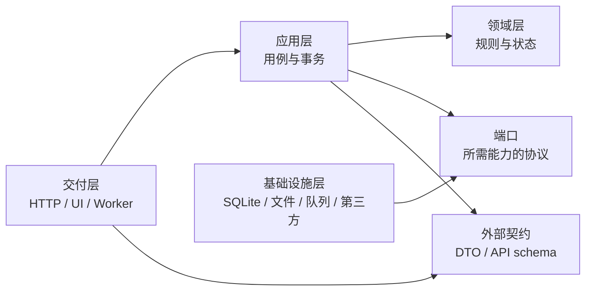

# 业务代码分层、隔离与重构规范

> 状态：建议作为新代码的默认约束，以及存量代码渐进式重构的目标结构。
>
> 适用范围：`apps/web`、`apps/api-python`、`packages/*`，以及与业务行为有关的 Worker、SQLite 迁移、PWA 和生成代码。
>
> 基线日期：2026-07-27。
>
> Agent 落地：仓库权威实现政策见 `AGENTS.md`；Cursor 会话约束见 `.cursor/rules/*.mdc`（按 alwaysApply / globs 注入）。本文件提供理由、目标结构与分期迁移计划。

## 1. 背景与代码质量结论

当前项目已具备较好的回归基础：Web 开启了 TypeScript `strict`，前后端都有业务行为测试，阅读器核心协议已经下沉到 `packages/reader-core`，中英文目录也有自动一致性检查。现阶段最主要的质量风险不是缺少功能或测试，而是部分存量模块同时承担了过多职责，导致修改影响面难以判断。

审计时的只读快照如下：

| 范围 | 结果 |
| --- | --- |
| Python 应用代码 | 62 个文件，约 30,952 行 |
| Python 测试 | 24 个文件，约 14,438 行 |
| 后端测试 | 342 通过，5 跳过，1 条第三方弃用警告 |
| Web 单元测试 | 182 通过 |
| Web 类型检查 | 通过 |
| Web i18n | `zh-CN` / `en-US` 共 2,763 条消息，检查通过 |
| Web lint | 通过，但 `components/layout/app-shell.tsx` 有 1 条 Hook 依赖警告 |

### 1.1 主要风险

| 优先级 | 证据 | 风险 |
| --- | --- | --- |
| P0 | `app/api/routes/compat.py` 约 8,036 行、310 个函数，包含 HTTP、授权、SQL、映射、文件处理和业务编排 | 任意功能调整都可能跨越多个隐含边界；复用 route 私有函数会继续扩大耦合 |
| P0 | `app/worker/importer.py` 约 3,207 行，串联校验、解析、转换、持久化、封面和事件 | 事务、文件发布、失败恢复和幂等行为集中在单一流程中，难以独立验证 |
| P0 | ~~`app/db/seed.py` 仍反向导入 service 做回填~~（已清：seed 仅用 ORM/typed expressions 插入缺失默认记录；历史 backfill、启动 repair 与 migration marker 已删除） | 数据 backfill 曾依赖运行期业务层 |
| P1 | ~~`reader_v2.py` 仍从 `compat.py` 导入私有实现~~（已清：页面索引走 `modules/media`） | 新边界曾依赖旧兼容路由，阻碍 `compat.py` 退场 |
| P1 | 后端约有 81 个 `except Exception`、813 处 `Any` | 部分稳定边界缺少错误分类和明确数据契约；需要按风险逐步收窄，不能机械清零 |
| P1 | Web 有约 39 个文件直接调用 `fetch`，分布在页面、Provider、组件和 feature 中 | 鉴权失效、错误 envelope、取消请求、响应校验和重试策略容易不一致 |
| P1 | `book-detail-page.tsx`、`reader-shell.tsx`、`app-shell.tsx` 等模块超过千行 | 展示、状态、请求和业务决策混合，局部修改容易触发大范围重新渲染或状态竞态 |
| P2 | `packages/shared` 只有少量示例类型，`packages/ui` 为空 | Monorepo 的公共边界尚未真正形成，Web 内部共享代码缺少稳定出口 |
| P2 | Python 尚未配置 Ruff、渐进类型检查和覆盖率可视化 | 现有测试可靠，但缺少低成本的静态质量反馈和趋势数据 |

行数只用于定位候选热点，不作为拆分的充分理由。真正的拆分依据必须是业务能力、状态所有权、事务边界、授权规则、错误契约和可独立测试性。

## 2. 目标与非目标

### 2.1 目标

1. 一个业务规则只在一个可命名的位置定义。
2. HTTP、数据库、文件系统、队列和第三方库都位于业务核心之外。
3. 依赖方向单向、可检查，不能通过私有函数或循环导入绕过边界。
4. 一个用例明确拥有事务和副作用顺序，失败后状态可解释、可恢复。
5. 前后端共享的是稳定协议，而不是某一端的内部数据结构。
6. 重构按业务能力小步迁移，保持 API、授权、数据库、Worker 和双语行为兼容。

### 2.2 非目标

- 不做一次性全仓目录搬迁。
- 不为了“看起来分层”给每个函数创建接口或类。
- 不建立万能 `utils.py`、`helpers.py`、`common_service.py` 或通用 Repository。
- 不允许仅以缩短文件为由改变事务、状态码、响应字段或 Worker 恢复语义。
- 不修改、打补丁或 vendoring `node_modules/epubjs`；阅读器问题只能在项目适配层处理。

## 3. 总体架构原则

### 3.1 按业务能力纵向组织，能力内部横向分层

顶层目录优先表达“图书馆、导入、阅读进度、整理、用户”等业务能力；每个能力内部再区分领域、应用、基础设施和交付层。这样既避免一个全局 `services` 继续膨胀，也避免同一用例散落在多个技术目录。



业务核心不依赖框架；基础设施通过端口被应用层调用，而不是由领域层直接导入。

### 3.2 依赖规则

允许：

```text
交付层 -> 应用层 -> 领域层
基础设施层 -> 应用层定义的端口 / 领域层定义的值对象
应用装配层 -> 所有层（仅负责创建和注入）
```

禁止：

```text
领域层 -> FastAPI / React / Next.js / SQLAlchemy / SQLite / fetch / Path / EPUB.js
应用层 -> HTTP Request/Response、React 组件或具体数据库引擎
基础设施层 -> route/page/component
一个 feature/module -> 另一个 feature/module 的内部文件
数据库迁移 -> 运行期 application/service
新模块 -> compat.py 私有函数
```

确需跨能力协作时，只能依赖对方的公共入口、稳定 DTO 或应用端口。不能使用深层相对路径访问内部实现。

## 4. 后端分层规范

### 4.1 领域层 `domain`

负责：

- 业务实体、值对象、状态机和不变量；
- 纯策略、判定和计算；
- 领域错误和领域事件的定义。

约束：

- 输入输出应是明确类型，不接收 `Request`、`Response`、`Session` 或数据库行字典；
- 不读环境变量，不访问时钟、随机数、网络和文件系统；这些能力通过参数或端口传入；
- 不提交事务、不记录 HTTP 状态码、不生成面向 UI 的本地化文案；
- 纯函数优先，测试不需要启动 FastAPI 或 SQLite。

示例：书籍身份归一化、重复判定、整理候选规则、阅读进度合并规则、导入状态迁移。

### 4.2 应用层 `application`

负责：

- 一个可命名用户用例的编排，例如 `ImportBook`、`MergeWorks`、`SaveReaderProgress`；
- 授权后的业务动作、事务范围和副作用顺序；
- 调用领域规则和端口；
- 把领域结果转换为用例 DTO。

约束：

- 一个入口对应一个业务意图，而不是一张表的 CRUD；
- 事务由用例拥有；Repository 和低层 helper 不得隐藏 `commit()`；
- 明确区分读取用例和写入用例；
- 预期失败使用稳定错误类型或错误码，不使用中文字符串参与程序分支；
- 对文件、队列、邮件、下载器和时间的访问通过端口完成；
- 应用层不得返回 FastAPI `Response`。

推荐接口形态：

```python
@dataclass(frozen=True)
class ImportBookCommand:
    actor_id: str
    source_path: str
    origin: str


class ImportBook:
    def execute(self, command: ImportBookCommand) -> ImportBookResult: ...
```

是否使用类取决于是否需要注入依赖和持有端口；单纯的无状态计算继续使用函数。

### 4.3 基础设施层 `infrastructure`

负责：

- SQLAlchemy/SQLite 查询与持久化；
- 文件系统、封面、备份、格式转换；
- 邮件、下载源、元数据提供方等外部集成；
- 队列存储和系统时钟等端口实现。

约束：

- Repository 按业务聚合或查询意图命名，不建立万能 Repository；
- SQL 只出现在本模块的 persistence adapter 或迁移中；
- 返回领域对象或明确的 persistence DTO，不把任意数据库行字典向上传播；
- 默认只做 `flush`，不做隐藏提交；需要独立事务的 outbox、租约等必须在接口名和文档中显式表达；
- 捕获异常时保留原始 cause，并翻译成应用层能够处理的基础设施错误；
- 文件写入优先采用“临时文件 -> 校验 -> 原子发布”，数据库记录和文件发布顺序必须可恢复。

### 4.4 交付层 `presentation`

包括 FastAPI route、Worker consumer、CLI 和定时任务入口。

FastAPI route 只负责：

1. 解析和校验 HTTP 输入；
2. 获取当前用户与依赖；
3. 调用一个应用用例；
4. 把结果/错误翻译成既有 status、code 和 response envelope。

Route 中禁止出现业务 SQL、长事务、媒体解析、文件搬运和跨多个 service 的流程编排。

Worker 只负责：

- lease、poll、retry、shutdown 和进程级兜底；
- 把消息转换为 command 并调用同一应用用例；
- 在进程边界记录足够上下文。

HTTP 与 Worker 必须复用应用用例，不能互相导入。`except Exception` 可以保留在进程/任务兜底边界，但必须记录任务标识、阶段和错误上下文，并明确重试或终止策略。

### 4.5 数据库迁移边界

- 每个 schema 版本独立、按序、可重复判断；
- 迁移只能依赖迁移内的稳定 SQL/数据转换函数，不得导入运行期 service；
- schema 变更与大数据回填分离；回填要支持中断后继续；
- 必测：空数据库、每个受支持旧版本、重复执行、部分执行、异常回滚/恢复；
- 不通过修改旧迁移改变已发布版本的含义；修复使用新版本迁移；
- `bootstrap.py` 只保留启动编排（调用 Alembic runner + seed）；schema 版本在 `app/db/alembic/versions/`。

## 5. Web 分层规范

### 5.1 App Router 层 `app`

负责路由、layout、metadata、错误边界和服务端入口。页面文件应尽量是薄装配：

```tsx
export default function LibraryRoute() {
  return <LibraryPage />;
}
```

`app` 不承载可复用业务规则，不直接拼装复杂 API 请求，不成为 feature 间的共享目录。

### 5.2 业务能力层 `features`

每个 feature 是一个用户可识别的能力，例如 library、reader、works、organize。推荐内部结构：

- `api/`：该能力的 API client、wire schema 和 mapper；
- `model/`：领域类型、纯规则、reducer、selector；
- `application/`：用例 hook、状态协调、缓存/同步策略；
- `ui/`：页面与业务组件；
- `public.ts`：其他目录唯一允许导入的公共出口。

约束：

- UI 组件不直接解释后端 envelope，不散落重复 `fetch`；
- `api` 统一使用共享 transport 处理 base URL、鉴权失效、AbortSignal、错误码和 JSON 校验；
- server DTO、页面 view model 与表单 state 分开，不用一个超大 interface 贯穿所有层；
- 数据归一化、排序、权限判定等纯规则放在 `model` 并独立测试；
- 一个 feature 不能深层导入另一个 feature；跨能力组合由 route、shell 或显式 orchestration feature 完成；
- `useEffect` 只同步外部系统，业务状态迁移优先使用 reducer/事件，依赖项不得靠关闭 lint 规避。

### 5.3 共享层

共享代码必须满足“至少两个业务能力真实复用，且语义稳定”，不能作为暂时不知道放哪里的收容区。

- `shared/api`：HTTP transport、API error、envelope 解析、请求取消；
- `shared/ui` 或 `packages/ui`：无业务含义的可访问性组件；
- `shared/lib`：极少量纯技术能力；
- `shared/i18n`：locale 契约和格式化入口；
- `packages/reader-core`：与 React、EPUB.js 和网络无关的阅读器协议与状态规则。

禁止在 `shared` 中出现 `bookId`、`shelfId` 等具体业务流程，除非它本身是经过确认的共享领域契约。

### 5.4 前端状态所有权

| 状态类型 | 所有者 |
| --- | --- |
| URL 可表达的筛选、分页、选中项 | URL / route |
| 服务端事实 | feature query/application 层 |
| 表单草稿 | 最近的表单组件或 form hook |
| 跨页面用户偏好 | 明确的 preference store / server contract |
| 阅读器会话 | `reader-core` 状态机 + adapter runtime |
| 纯视觉展开/hover | 局部 UI 组件 |

同一状态不能同时由 URL、组件 state 和 Provider 各自维护真值。需要派生时使用 selector，不复制并通过多个 effect 相互同步。

## 6. 目标目录结构

这是迁移目标，不要求一次性创建所有空目录。只有在迁入真实代码时才创建目录。

### 6.1 后端

```text
apps/api-python/
├── app/
│   ├── bootstrap/                   # 应用装配、生命周期、依赖注入
│   │   ├── api.py
│   │   └── worker.py
│   ├── core/                        # 配置、通用鉴权原语、时间/locale 契约
│   ├── contracts/                   # 跨能力稳定 DTO、response envelope
│   ├── modules/
│   │   ├── library/
│   │   │   ├── domain/
│   │   │   │   ├── entities.py
│   │   │   │   ├── policies.py
│   │   │   │   └── errors.py
│   │   │   ├── application/
│   │   │   │   ├── commands/
│   │   │   │   ├── queries/
│   │   │   │   ├── dto.py
│   │   │   │   └── ports.py
│   │   │   ├── infrastructure/
│   │   │   │   ├── persistence.py
│   │   │   │   └── files.py
│   │   │   ├── presentation/
│   │   │   │   ├── http.py
│   │   │   │   ├── schemas.py
│   │   │   │   └── mappers.py
│   │   │   └── public.py
│   │   ├── imports/
│   │   ├── reader_progress/
│   │   ├── organize/
│   │   ├── identity/
│   │   ├── metadata/
│   │   ├── users/
│   │   ├── downloads/
│   │   └── system_health/
│   ├── infrastructure/             # 真正跨能力的 SQLite、文件、邮件基础实现
│   ├── db/
│   │   ├── migrations/
│   │   │   ├── v001_initial.py
│   │   │   └── ...
│   │   └── runner.py
│   └── api/
│       └── routes/
│           └── compat.py            # 迁移期仅做旧路径聚合和兼容翻译
└── tests/
    ├── unit/modules/
    ├── integration/modules/
    ├── contract/api/
    └── migration/
```

`core` 和顶层 `infrastructure` 必须保持很小。只被单一业务能力使用的代码必须留在该 module 内，不得为了“复用可能性”提前上提。

### 6.2 Web

```text
apps/web/
├── app/                              # Next.js route 与 layout
├── features/
│   ├── library/
│   │   ├── api/
│   │   │   ├── client.ts
│   │   │   ├── schemas.ts
│   │   │   └── mappers.ts
│   │   ├── model/
│   │   │   ├── types.ts
│   │   │   ├── rules.ts
│   │   │   └── rules.test.ts
│   │   ├── application/
│   │   │   ├── use-library-query.ts
│   │   │   └── use-library-actions.ts
│   │   ├── ui/
│   │   │   ├── library-page.tsx
│   │   │   └── ...
│   │   └── public.ts
│   ├── reader/
│   ├── works/
│   ├── organize/
│   ├── settings/
│   └── ...
├── shared/
│   ├── api/
│   │   ├── transport.ts
│   │   ├── envelope.ts
│   │   └── errors.ts
│   ├── i18n/
│   ├── lib/
│   └── ui/
├── generated/                        # OpenAPI 等生成物，禁止手改
└── e2e/

packages/
├── reader-core/                      # 纯阅读器协议、偏好、状态机
├── ui/                               # 真正跨 app 的无业务 UI
└── shared/                           # 真正跨 app 的稳定协议；不复制 Web 内部类型
```

## 7. 隔离边界

### 7.1 API 契约

- 保留现有 path、method、status、字段名和 `app/schemas/responses.py` envelope；
- 稳定错误以 `code` 为程序契约，message 仅用于显示，不参与前端条件分支；
- 后端新增用户可见文案时同时考虑 `zh-CN`、`en-US`；
- 动态书名、作者、标签、路径等用户数据不翻译；
- Reader V2 等稳定接口优先从 OpenAPI 生成客户端类型，生成文件禁止手改；
- 兼容接口迁移时先建立 contract test，再移动实现，最后才删除旧入口。

### 7.2 授权

- 身份认证在交付层完成，资源级授权作为显式 policy/用例前置条件；
- 查询列表必须在数据库查询阶段应用可见性范围，不能先全量读取再前端过滤；
- not-found 与 forbidden 的既有防枚举语义必须保持；
- admin、system manager、scoped user、ordinary user、anonymous 的行为都应有测试；
- 不依赖仅按 URL 前缀判断权限的中间件作为唯一保护，每个敏感用例仍需资源级校验。

### 7.3 事务与副作用

一个写用例必须明确记录以下顺序：

1. 校验与授权；
2. 读取当前状态；
3. 执行业务规则；
4. 写数据库/文件临时态；
5. 提交事务；
6. 发布文件、事件或队列消息；
7. 失败补偿或可恢复标记。

跨 SQLite 与文件系统无法实现真正原子事务时，必须使用可识别的中间状态、幂等键和恢复流程，不能依赖“通常不会失败”。

### 7.4 第三方与运行环境

- EPUB.js、PDF.js、Pillow、元数据提供方、SMTP 等只能由 adapter 接触；
- 应用层只认识项目定义的端口和错误；
- 第三方异常不能直接穿透为 HTTP 文案；
- 时间、locale、随机 ID 和环境配置通过统一入口获得，测试可替换；
- PWA 私有缓存必须继续按用户和授权版本隔离。

### 7.5 类型边界

- 外部输入先视为 `unknown`/未验证数据，验证后再进入应用层；
- `dict[str, Any]` 只允许停留在不稳定 SQL/第三方边缘，并尽快映射为 DTO；
- 稳定数据库投影可使用 dataclass、TypedDict 或 Pydantic model；
- 不为追求类型覆盖率给大面积代码添加 `Any`、`type: ignore`、`noqa`；
- 前端禁止把 API wire type 直接作为可编辑表单 state，避免未提交草稿污染服务端模型。

## 8. 渐进式重构流程

每次只迁移一个可命名业务能力，按以下顺序执行：

1. **定义能力面**：列出入口、调用者、授权角色、状态变化、文件/队列副作用和双语文案。
2. **固定契约**：补充 happy path、validation、authorization、not-found、conflict、failure 和恢复测试。
3. **提取纯规则**：先移动 normalization、mapping、policy、state transition，不改 I/O。
4. **建立端口**：把 SQL、文件或第三方调用收敛到能力内 adapter。
5. **建立用例**：让应用层拥有编排和事务；HTTP 与 Worker 共同调用用例。
6. **切换入口**：旧 route 保持原路径，只委托新用例并翻译回原 envelope。
7. **删除重复实现**：确认无调用后移除旧私有 helper，禁止长期双写。
8. **运行门禁**：先能力测试，再全量测试、类型、lint、i18n 和必要 smoke/e2e。
9. **记录决策**：跨能力边界或兼容策略变化写 ADR。

每个重构 PR 应满足：

- 只覆盖一个业务能力或一个清晰的基础设施边界；
- 说明不变量和未改变的公开行为；
- 不混入无关格式化、依赖升级和产品改版；
- 新旧路径不长期并存；
- 可独立回滚，不要求后续 PR 才恢复可用状态。

## 9. 推荐重构顺序

### 阶段 A：先建立边界工具

1. Web 建立统一 API transport 和 error/envelope 解析，先迁移一个低风险 feature。
2. 增加自定义依赖边界检查，禁止 feature 深层互相导入、禁止新代码导入 `compat.py` 私有符号。
3. 后端分开引入 Ruff、覆盖率报告和渐进类型检查；先测量再设门禁。

### 阶段 B：拆解高风险兼容路由

按业务能力从 `compat.py` 迁出，而不是按函数数量平均拆分：

1. system health / settings 等读取面；**已完成（B-1）**：`app/modules/system/` 承接 SystemSetting KV、SystemEvent、健康检查/运行记录与队列运行时 ORM；旧 `services/health*.py` / `system_events.py` / `queue_runtime.py` 为兼容 re-export。
2. metadata / sources；**已完成核心（B-2）**：Source 外部来源能力已退役并保持空列表/410/404 兼容契约，不再读取历史来源数据；provider registry、lookup queue 持久化均在 `app/modules/metadata/infrastructure/`（ORM）。
3. library 查询与 facets；**已完成核心（B-3）**：facets、merge/rename/split/delete/undo/duplicate_groups、`smart_shelf_work_ids`、作品投影、文件/封面/存储、普通写操作与结构操作已迁入命名 ORM adapter；compat 通用数据库 helper 与 `select_compat.py` 已删除。
4. organize；**进行中（B-4 评审面已迁）**：`OrganizePolicy`、scheduler 入队/cancel/recognize/delete，以及 `organize_service` 的 suggestion/duplicate apply、merge、external cache、job/work context 持久化均已迁入 `app/modules/organize/infrastructure/`（及 metadata `external_cache`）；compat organize jobs list/detail 已走 `job_queries` ORM。
5. upload / imports / monitor folders；**已完成核心（B-5）**：worker 与 compat import-tasks/monitor-folders HTTP 已走 `app/modules/imports/infrastructure/` ORM（含 `import_http`）。
6. files / media streaming；**已完成核心（B-6）**：页面索引已下沉 `app/modules/media/`，`reader_v2` 不再依赖 compat 私有符号。

另：书架 CRUD 已迁入 `app/modules/shelf/`；download HTTP 已接入 application DTO、repository port 与 composition root；source HTTP 保留已退役契约；`app/`（排除 migrations）目标为无运行时 `execute(text)`。

后续能力顺序（仍按文档）：reader → downloads → kindle → users/auth → backup。

每一批保留原 URL 和 envelope。页面索引已下沉 media 模块，`reader_v2` 对 `compat.py` 私有函数的反向依赖已消除；compat 内原 `_row/_rows/_scalar/_table_count/_insert/_update/_update_where/_delete/_list_table_response` 调用已清零，反射 SELECT 兼容桥已删除。

### 阶段 C：拆解导入流水线

按阶段提取：

```text
eligibility/identity
-> media inspection
-> conversion
-> persistence
-> cover publication
-> event/reporting
```

先保留一个顶层 orchestrator，再逐段替换。幂等、源文件保留、转换来源、重复合并、任务进度和失败恢复必须作为显式状态机测试。

### 阶段 D：迁移数据库启动逻辑

**已完成（v14-only）**：schema 迁移已切换到 Alembic；权威目标态为单条 baseline revision（原 `user_version=14`）。启动仅支持空库、完整 v14 库、已有 Alembic 库及与 baseline 等价的 `create_all` 测试库；pre-v14 库明确拒绝。后续 schema 变更只新增 Alembic revision。`app/db/seed.py` 只插入缺失默认记录，不执行历史 backfill 或业务状态 repair。

升级测试覆盖空库、v14 stamp、已有 Alembic 和 baseline-equivalent 测试库，并验证 pre-v14 在任何修复或 stamp 前失败。禁止在没有升级测试时移动或重写已发布的 Alembic revision（修复用新版本）。

### 阶段 E：拆分 Web 大型页面

优先处理同时含请求、复杂状态和多视图渲染的模块：

1. `features/works/book-detail-page.tsx`；
2. `features/reader/reader-shell.tsx`；
3. `components/layout/app-shell.tsx`；
4. settings 与 library 大页面。

先提取纯 model 和 API，再提取 application hook，最后拆 UI。不要通过创建大量只有转发 props 的小组件制造表面模块化。

## 10. 质量门禁与完成定义

### 10.1 当前必须通过

```bash
# Backend
cd apps/api-python
uv run --no-sync pytest -q

# Web
cd apps/web
pnpm test
pnpm typecheck
pnpm lint
pnpm i18n:check
```

涉及运行期、数据库升级、导入 Worker 时，按范围增加：

```bash
pnpm verify:python-backend
pnpm smoke:python-api
pnpm smoke:python-worker
pnpm smoke:python-worker-import
pnpm smoke:python-sample
```

涉及关键用户流程、PWA、移动布局或阅读器交互时，运行对应 Playwright 用例。文档变更不要求无关的构建和 E2E。

### 10.2 建议逐步新增

- Ruff format/check；
- 针对稳定 module 的 mypy 或 Pyright；
- pytest-cov，只观察趋势，不以全仓单一覆盖率替代风险测试；
- 前端 feature 依赖边界检查；
- OpenAPI 生成物漂移检查；
- 发布版本一致性检查；
- SQLite 支持升级矩阵测试。

工具必须单独引入、固定版本、先让现有基线通过，再进入 CI。不得用全局 ignore 掩盖存量问题。

### 10.3 Definition of Done

- [ ] 业务能力、调用者和不变量已说明；
- [ ] 依赖方向符合本规范，没有新增反向依赖；
- [ ] route/page/worker 保持薄适配；
- [ ] 事务所有者、提交点和失败恢复明确；
- [ ] 授权覆盖所有相关角色和资源范围；
- [ ] API/status/envelope/Worker/SQLite 兼容行为未意外变化；
- [ ] 用户可见内容同时适配 `zh-CN` 和 `en-US`；
- [ ] 稳定边界使用明确类型，未扩散 `Any`；
- [ ] 聚焦测试与适用的全量门禁通过；
- [ ] 没有未说明的双实现、临时兼容层和新增 lint warning。

## 11. 评审检查清单

评审者至少回答：

1. 代码属于哪个业务能力，放置位置是否表达了这个事实？
2. 业务规则是否被 HTTP、SQL、React 或第三方 API 污染？
3. 是否存在跨 feature/module 的内部导入或循环依赖？
4. 谁拥有事务？低层函数是否隐藏提交？
5. 文件、队列和数据库的失败顺序是否可恢复？
6. 授权是资源级还是只依赖 URL/按钮可见性？
7. 错误码能否稳定供程序判断，文案是否可本地化？
8. 测试是否覆盖行为和边界，而不仅是实现细节？
9. 这次重构是否真正减少职责、依赖或重复规则？
10. 是否留下了有 owner、有退出条件的临时兼容代码？

## 12. 例外管理

无法立即遵守本规范时，必须在代码附近或 ADR 中记录：

- 被违反的规则；
- 当前阻塞原因；
- 风险与保护性测试；
- 责任模块；
- 清理条件，而不是模糊的“后续优化”。

兼容代码是迁移工具，不是新架构的一层。任何新增兼容入口都必须有明确退出条件。
