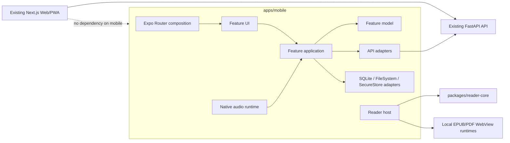

# React Native + Expo 客户端实施计划

> 状态：Proposed
> 基线日期：2026-07-30
> 目标平台：Android 手机/平板、iPhone、iPad
> 首版定位：面向阅读与收听的配套客户端，系统管理继续由 Web 承担

## 1. 决策摘要

在现有 monorepo 中新增独立的 `apps/mobile`，使用 React Native、Expo Development Build、Expo Router 和 TypeScript strict 开发一套 Android/iOS 客户端。

客户端复用：

- FastAPI 现有公开 API、资源级授权和 Reader v2；
- `packages/reader-core` 中的平台无关阅读协议、偏好与状态机；
- FastAPI OpenAPI 作为唯一服务端契约来源；
- 现有 `zh-CN` / `en-US` 完整性原则和根版本号。

客户端不复用：

- Next.js 页面、React DOM 组件和 Web 私有 feature；
- Web 的 Cookie/sessionStorage/IndexedDB/PWA 实现；
- EPUB、PDF、漫画和音频的 DOM 表现层；
- Web 的生成文件和 i18n 私有目录。

移动端不是整个 Web 的 WebView 套壳。只有 EPUB 和 PDF 渲染引擎运行在受控的本地 WebView runtime 中；导航、书库、漫画、下载、同步、有声书和系统集成都使用 React Native/Expo 能力。

### 1.1 初始技术版本

仓库当前 Node.js 固定为 22.23.1，已满足 Expo SDK 57 的 Node.js 22.13.x 最低要求，Web Docker 镜像也已完成 Node 22 对齐。因此首期直接采用 Expo SDK 57；React Native New Architecture 和所有原生模块仍须在 M0 完成兼容性与真机验证，不借移动端初始化升级现有 Web 的 React、Next.js 或其他依赖。

Expo SDK、React Native、React 和所有原生模块都必须固定在 lockfile 中，不使用漂移的 latest。

## 2. 不影响 Web 的硬约束

以下约束是合并条件，不是建议：

1. `apps/mobile` 不得导入 `apps/web/**`。
2. `apps/web` 不得依赖 `apps/mobile`、移动端生成物或移动端原生模块。
3. 不为了移动端升级 Web 的 React、Next.js、Node.js 或现有 EPUB.js。
4. 不修改现有 `/api/auth/login` 的 path、Cookie、status、response envelope 或错误码。
5. 后端移动能力只做向后兼容的增量接口；现有书库、Reader v2 和媒体接口继续作为唯一业务实现。
6. 不增加一套重复的 “Mobile Library API”。
7. 不把 Bearer/refresh token 暴露给 EPUB/PDF WebView。
8. 不为移动端开启通配 CORS 或把 token 放入 URL query。
9. `packages/reader-core` 只接受平台无关、向后兼容且有 Web/Mobile 两个真实消费者的规则。
10. 提取 Web 纯规则时，必须单独成 PR：先加特征测试，再移动规则，再切换 Web import；不得与移动 UI 开发混在一起。
11. Mobile CI 成熟前独立运行，不改动现有 fnOS/Web 发布链；触及后端、根依赖或共享包时必须运行 Web 回归门禁。
12. 现有生产镜像仍只构建 Web/Python；`apps/mobile` 加入 `.dockerignore`，不得扩大当前 Docker 构建上下文。

## 3. 产品范围

### 3.1 Beta 范围

- 手工添加自托管服务器地址；
- 服务器初始化状态探测；
- 设备登录、自动刷新、注销；
- 书库首页、搜索、筛选、书架、作品详情；
- 封面展示；
- 漫画、EPUB、PDF 在线阅读；
- 阅读偏好、书签、进度恢复与同步；
- 手机和平板自适应布局；
- `zh-CN`、`en-US`；
- 深色模式、Dynamic Type/字体缩放、VoiceOver/TalkBack 基础支持；
- Android/iOS 内部分发安装包。

### 3.2 V1 范围

- EPUB、PDF、漫画和有声书离线下载；
- 有声书后台播放、锁屏控制、耳机控制、中断恢复、倍速和睡眠定时；
- 下载暂停、恢复、校验、空间不足和失效处理；
- 多服务器 profile 与同一服务器多地址切换；
- iPad/Android 平板双栏或三栏、横屏、键盘、鼠标/触控板；
- TestFlight 和 Google Play Internal Testing；
- 可安装升级、App 数据迁移和分阶段发布。

### 3.3 首版不做

- 在手机上运行 Python、Worker 或服务端 SQLite；
- 服务端系统管理、备份恢复、元数据提供方配置；
- 完整导入任务管理、监控文件夹和下载器管理；
- 与 Web 页面像素级一致；
- 修改或 patch EPUB.js；
- 桌面端；
- 远程推送通知；
- 默认采集用户阅读内容或行为分析。

管理能力保留在 Web。App 可提供“在 Web 管理端打开”的安全深链，但不嵌入已登录的管理页面。

## 4. 当前可复用基础

### 4.1 公开服务入口

生产环境只公开 Web 端口，Next 将 `/api/*` 转发给容器内 FastAPI。App 保存的是用户可访问的 Web 根地址，而不是内部 Python 8000 端口。

示例：

```text
https://books.example.com
https://nas.example.com/apps/booknook
http://192.168.1.20:7209
```

Reader v2 返回的文件、音轨和页面地址保持相对 URL，由当前 server profile 解析。不得改成绝对 URL，否则会破坏反向代理和 base path 部署。

### 4.2 Reader v2

现有 Reader v2 已提供：

- edition bootstrap；
- 格式、卷、章节、漫画页和音轨；
- 阅读能力、偏好和恢复位置；
- `contentFingerprint`；
- 书签；
- EPUB locations 缓存/租约；
- `mutationId`、`clientId`、`clientSequence` 和 `applied`；
- 相同客户端序列的幂等/单调写入。

移动端直接复用该协议。首版维持当前跨客户端“按服务器到达顺序覆盖”的语义，不改变 Reader v2。若以后需要 Web/App 强冲突检测，应新增 Reader v3 的 `progressVersion/baseVersion`，不能静默改变 v2。

### 4.3 媒体流

现有媒体层已支持：

- GET、HEAD（`/api/files/{fileId}`）；
- 单一 byte range；
- 200、206、304、416；
- `If-Range`；
- `Accept-Ranges`、`Content-Length`、`Content-Range`；
- ETag、Last-Modified；
- 每用户流并发限制；
- 文件、edition、volume、work 资源级授权。

移动端下载并发默认限制为 2，最多允许用户调整至 4；429 使用带抖动的指数退避。弱 ETag 导致恢复请求返回 200 时，必须重建临时文件，不能追加到 partial 文件。

### 4.4 `reader-core`

移动端直接依赖：

- `ReaderKind`、`ReaderLocation`；
- `ReaderPreferences`；
- `ReaderCommand`、`ReaderCapabilities`；
- `ReaderAdapterEvent`；
- `ReaderAdapter` 生命周期和取消；
- session/operation token 状态机；
- 偏好默认值、迁移和 `unknown` 输入归一化。

不在移动端重新定义这些协议。

## 5. 目标架构



依赖方向：

```text
app route -> feature UI -> feature application -> feature model
feature api/storage adapters -> application ports and explicit model types
reader host -> reader-core + format-specific adapter
```

禁止：

```text
feature UI -> raw fetch / SecureStore / SQLite / FileSystem
feature A -> feature B private files
mobile -> web private code
WebView -> long-lived credentials
generated DTO -> editable UI state
```

## 6. 建议目录

```text
apps/mobile/
├── app/                                  # Expo Router；只做组合和导航
│   ├── _layout.tsx
│   ├── (auth)/
│   ├── (main)/
│   ├── work/[workId].tsx
│   └── reader/[editionId].tsx
├── features/
│   ├── servers/
│   │   ├── api/
│   │   ├── model/
│   │   ├── application/
│   │   ├── ui/
│   │   └── public.ts
│   ├── identity/
│   ├── library/
│   ├── reader/
│   │   ├── adapters/
│   │   │   ├── comic/
│   │   │   ├── epub-webview/
│   │   │   └── pdf-webview/
│   │   ├── application/
│   │   ├── model/
│   │   ├── ui/
│   │   └── public.ts
│   ├── reader-progress/
│   ├── downloads/
│   └── audio/
├── shared/
│   ├── api/
│   ├── i18n/
│   ├── storage/
│   ├── telemetry/
│   └── ui/
├── generated/                            # 生成物；禁止手改
├── reader-runtimes/
│   ├── epub/                             # WebView runtime 源码
│   └── pdf/
├── scripts/
│   ├── generate-api.mjs
│   ├── check-api-drift.mjs
│   ├── build-reader-runtimes.mjs
│   └── check-i18n.mjs
├── tests/
├── .maestro/
├── app.config.ts
├── eas.json
├── package.json
└── tsconfig.json
```

目录只在放入真实代码时创建。不得新增顶层 `utils`、`helpers`、`managers` 或通用 `services`。

## 7. 技术选型

| 领域 | 选择 |
| --- | --- |
| 运行时 | React Native + Expo SDK 57 Development Build |
| 导航 | Expo Router |
| 语言 | TypeScript strict |
| 服务端状态 | TanStack Query |
| 工作流状态 | 纯 reducer/显式状态机 |
| API transport | `shared/api` 中的唯一 fetch 入口 |
| 外部数据校验 | feature `api/schemas.ts` 运行时校验 |
| 安全凭据 | Expo SecureStore |
| 本地结构化数据 | Expo SQLite + capability repository |
| 本地文件 | Expo FileSystem |
| 网络变化 | NetInfo |
| EPUB/PDF | React Native WebView + 本地 runtime |
| 漫画 | React Native 原生图片 + Gesture Handler/Reanimated |
| 有声书 | Expo Audio；验证失败时封装自有 Expo Module |
| 单元/组件测试 | Jest + React Native Testing Library |
| E2E | Maestro |
| 构建 | Expo CNG + EAS Build |

不默认引入全局 Zustand/Redux。只有出现真实、跨页面、无法由 server cache、URL/router 或 feature runtime 所有的状态时，才用单独 ADR 引入。

## 8. pnpm、React 和 monorepo 隔离

现有 `pnpm-workspace.yaml` 已覆盖 `apps/*`，新增 `apps/mobile` 不需要修改 workspace 范围。

Mobile 使用 Expo SDK 57 对应的 React 19.2 和 React Native 0.86，Web 使用 Next.js 16 对应的 React 19。必须：

- 保留 pnpm isolated dependency 安装策略；
- 不在根目录用 override/resolution 强制 React 单版本；
- `packages/reader-core` 保持无 React 运行时依赖；
- Mobile 只显式依赖自己的 React、React Native 和 Expo 版本；
- 每次依赖更新运行 `expo-doctor`；
- 检查 Mobile 构建中没有重复原生模块；
- 不为了去重将 Web 升级到 React 19。

门禁：

```bash
pnpm --filter @booknook/mobile why react react-native expo
pnpm --filter @booknook/web why react react-dom
pnpm --filter @booknook/mobile doctor
```

后续 Expo SDK 升级条件：

1. 保持已通过的 Web Node 22 兼容性门禁；
2. Python/构建脚本和 fnOS/Docker 构建通过；
3. Mobile 所有原生模块支持目标 React Native New Architecture；
4. 作为独立 PR 合并，不夹带产品功能。

## 9. 后端兼容扩展

### 9.1 服务器信息

新增公开只读接口：

```text
GET /api/mobile/v1/server-info
```

响应至少包含：

```ts
type MobileServerInfo = {
  product: 'booknook';
  instanceId: string;
  displayName: string;
  version: string;
  apiVersions: string[];
  authMethods: Array<'device-bearer'>;
  initialized: boolean;
  supportedLocales: Array<'zh-CN' | 'en-US'>;
};
```

`instanceId` 是数据库持久化 UUID，不能使用进程/Worker 实例 ID。App 的账号、token、SQLite、文件、下载和 outbox 均以：

```text
serverInstanceId + userId
```

隔离。服务器 URL 只是一个可替换连接地址。

### 9.2 设备会话

保留现有 Cookie 登录，新增：

```text
POST   /api/mobile/v1/auth/login
POST   /api/mobile/v1/auth/refresh
POST   /api/mobile/v1/auth/logout
GET    /api/mobile/v1/auth/devices
DELETE /api/mobile/v1/auth/devices/{deviceSessionId}
```

后端 `DeviceSession` 至少包含：

```text
id
userId
deviceId
deviceName
platform
accessTokenHash
refreshTokenHash
tokenFamilyId
accessExpiresAt
refreshExpiresAt
rotatedAt
revokedAt
lastUsedAt
createdAt
```

规则：

- 使用随机 opaque token，不使用可长期自验证且难撤销的 JWT；
- access token 短期有效，refresh token 长期有效并每次轮换；
- 数据库只存 hash；
- 重用旧 refresh token 时撤销 token family；
- 修改密码、停用或删除用户时同时撤销 Cookie 与设备会话；
- App 只通过 `Authorization: Bearer` 发送 access token；
- token 不进入 URL、日志、SQLite、WebView 或崩溃上下文；
- refresh token 仅存 SecureStore；
- Web 登录响应不返回 token。

统一认证解析器接受 Cookie 或 Bearer，并继续返回同一种 authenticated actor。资源级授权仍由原有 library/reader/media 用例执行。

### 9.3 缓存隔离

加入 Bearer 后，用户态响应至少设置：

```http
Vary: Cookie, Authorization
Cache-Control: private
```

认证、会话和敏感响应使用 `no-store`。测试覆盖：

- Cookie 与 Bearer；
- 两个用户；
- JSON、封面、Reader bootstrap；
- 200/206/304/401/404/416；
- Range 和 HEAD。

### 9.4 OpenAPI

保留 Web 的现有生成脚本和 `apps/web/generated/reader-v2.ts`。

新增 Mobile 生成流程：

1. 从 FastAPI 导出 OpenAPI；
2. 只选择 Mobile V1、auth/me、dashboard、works、shelves、Reader v2 和媒体相关 operation；
3. 生成 `apps/mobile/generated/api.ts`；
4. 生成文件提交到仓库，使 EAS 不依赖 Python/uv；
5. CI 重新生成并检查 drift；
6. HTTP JSON 仍作为 `unknown` 接收，在 feature `api/schemas.ts` 校验并映射为 model。

OpenAPI 新增 `cookieAuth`、`bearerAuth` security scheme，并明确每个 operation 的安全要求。

### 9.5 下载清单

完整离线阶段新增：

```text
GET /api/mobile/v1/editions/{editionId}/download-manifest?volume={volumeId}
```

清单只编排当前用户可见资源：

```ts
type DownloadManifest = {
  editionId: string;
  volumeId: string | null;
  contentFingerprint: string;
  format: 'epub' | 'pdf' | 'comic' | 'audio';
  totalBytes: number;
  assets: Array<{
    assetId: string;
    fileId: string;
    url: string;
    mimeType: string;
    filename: string;
    size: number;
    contentHash: string;
    sortOrder: number;
  }>;
};
```

不得暴露服务端文件系统路径。每个 asset 继续通过现有受授权媒体端点下载。给 `/api/editions/{editionId}/file` 补 HEAD，与 `/api/files/{fileId}` 对齐。

## 10. Mobile API transport

只有 `shared/api/transport.ts` 和 feature `api/client.ts` 可以发起网络请求。

Transport 负责：

- server base path 解析；
- Bearer access token；
- 单飞 refresh 和失败后的统一注销；
- `AbortSignal`；
- request correlation ID；
- JSON/content-type/envelope 解码；
- 401、429、超时、离线和传输错误归一化；
- 重定向 host/scheme 变化时移除 Authorization；
- 不记录 body、token、Cookie 或书籍内容。

Feature API adapter 负责：

- endpoint 参数；
- `unknown` 响应运行时校验；
- wire DTO -> feature model；
- 稳定错误码 -> named outcome。

UI 不处理原始 HTTP status、后端本地化 message 或任意字典。

## 11. 本地数据和同步

### 11.1 存储所有权

| 数据 | 所有者 |
| --- | --- |
| access/refresh token | SecureStore |
| server URL、instanceId、非秘密 profile | servers repository |
| 书库缓存 | library SQLite repository |
| 阅读偏好 | reader preferences repository |
| 待同步进度 | reader-progress SQLite outbox |
| 下载状态 | downloads SQLite repository |
| EPUB/PDF/漫画/音频内容 | App 私有文件目录 |
| 页面临时状态 | 最近的 UI component/reducer |
| 服务端事实 | TanStack Query + feature application |

SQLite 不成为一个通用数据库访问层。各 capability 拥有自己的 repository、migration 和 DTO；UI/application 不写 SQL。

### 11.2 进度 outbox

沿用 Web 已验证的语义：

```text
先写持久 outbox
→ debounce
→ 按 clientSequence 顺序发送
→ compare-delete
→ 成功更新本地 head
→ 可重试错误指数退避
→ terminal/fingerprint 冲突隔离
```

规则：

- `clientId` 每个安装生成一次；
- `clientSequence` 按 `serverInstanceId + userId + workId + clientId` 持久单调递增；
- `mutationId` 全局唯一；
- AppState、NetInfo、登录完成和 reader dispose 唤醒同步；
- 不创建无所有者的 fire-and-forget task；
- 收到 `applied:false` 后重新拉 bootstrap；
- 收到 `CONTENT_FINGERPRINT_MISMATCH` 后隔离旧 outbox、清除该内容位置并重新 bootstrap；
- 账号切换立即取消旧请求，旧账号队列不得由新账号发送。

恢复顺序：

```text
明确深链位置
> 同 server/user/edition/volume/fingerprint 的本地待同步位置
> 服务端 bootstrap 位置
```

### 11.3 下载状态机

```text
queued
→ downloading
→ verifying
→ ready

downloading/verifying
→ paused | failed | invalidated

ready
→ deleting
→ removed
```

要求：

- 临时路径下载；
- 校验长度和 hash 后原子发布；
- partial 与 manifest fingerprint 绑定；
- 200 覆盖恢复请求时重新开始，禁止把完整响应追加到 partial；
- “删除下载”和“从书库删除”是不同命令；
- 用户明确保存的离线内容不被普通 cache LRU 自动清除；
- transient cache 可按空间预算清理；
- 退出账号默认撤销会话并锁定该账号数据，提供单独的“同时删除本机内容”操作；
- 服务器、账号和 fingerprint 变化时不静默复用文件；
- iOS/Android 杀进程后可从 SQLite 状态恢复。

首版不承诺无限后台下载。阶段 0 验证 Expo/平台后台传输能力；若无法满足大文件可靠下载，则用自有 Expo Module 封装 iOS background `URLSession` 和 Android foreground work，而不是依赖 JavaScript 定时器。

## 12. 阅读器实现

### 12.1 共享控制层

Mobile Reader runtime 持有：

- `ReaderSessionState`；
- 当前 `ReaderAdapter`；
- operation token；
- abort/dispose；
- controls visibility；
- progress outbox；
- local/remote source selection。

Reader UI 只发送用户意图，不直接调用 EPUB.js、PDF.js、SQLite 或 fetch。

### 12.2 WebView bridge

EPUB/PDF 共用版本化消息 envelope：

```ts
type ReaderBridgeEnvelope = {
  protocolVersion: 1;
  messageId: string;
  sessionId: string;
  operation: OperationToken | null;
  type: string;
  payload: unknown;
};
```

每条消息必须运行时校验。Bridge 只传命令、事件、位置、偏好、元数据和小型控制消息，禁止 Base64 传整本书。

WebView runtime：

- 是 Mobile 构建产物，不是 Next 页面；
- 从官方 npm EPUB.js/PDF.js 构建；
- 不修改第三方源码；
- 不内联超大 JS 字符串到 TypeScript bundle；
- 使用 CSP 和严格外链 allowlist；
- 默认禁止远程脚本、表单、对象和任意连接；
- 不持有 access/refresh token；
- 外链只产生 `external-link` 事件，由原生 UI 确认后打开；
- dispose 时移除 observer/listener/object URL/worker。

### 12.3 漫画

漫画使用 React Native 原生图片和手势，语义保持：

- 单页/双页；
- LTR/RTL；
- 横滑、点击区、工具栏和进度跳转；
- 缩放时停用翻页；
- 当前 spread 前后有限预加载；
- 原图/省流版本切换使旧缓存失效；
- file URI 与远端 source 统一 adapter；
- 大图按内存预算解码和释放。

漫画是第一个完整垂直切片，用于验证：

```text
Reader v2 bootstrap
→ ReaderAdapter
→ reader-core session
→ 原生输入
→ 本地 outbox
→ 服务端进度
```

### 12.4 EPUB

EPUB 使用本地 WebView runtime + 官方 EPUB.js：

- CFI、href、spineIndex、progression；
- 目录跳转；
- paginated/scrolled；
- 单/双页；
- 字体、字号、行高、主题；
- 文本选择；
- iframe 内点击、滑动、键盘和外链事件；
- locations 按 fingerprint 缓存；
- WebView 重建后从明确位置恢复；
- 不向 WebView注入长期凭据。

### 12.5 PDF

第一版使用独立 PDF WebView runtime + PDF.js：

- pageNumber；
- fit width/page；
- zoom；
- password-required；
- 文本选择；
- 页面缓存和渲染预算；
- Worker 本地打包；
- Range 或已下载本地文件；
- 旋转、分屏和 WebView 重建恢复。

以后可用 PDFKit/PdfRenderer 替换具体 adapter，上层继续依赖同一个 `ReaderAdapter`。

### 12.6 有声书

有声书不加入视觉 `ReaderKind`，由独立 audio capability 管理：

- 原生后台播放；
- 锁屏/通知中心元数据与控制；
- 蓝牙耳机；
- 系统中断、来电和音频焦点；
- track/章节切换；
- 倍速与音高修正；
- 快进、快退、睡眠定时；
- 远端 Range 与本地离线文件；
- App/进程恢复；
- 使用既有音频进度位置和同步协议。

## 13. 手机和平板设计

按可用窗口宽度而不是硬件类型适配：

```text
compact   < 600
medium    600–839
expanded  >= 840
```

阈值在真实设备验证后固化为 design token。

| Surface | Compact | Medium/Expanded |
| --- | --- | --- |
| 主导航 | 底部标签 + stack | 侧边栏/Navigation Rail |
| 书库 | 单列进入详情 | 列表 + 详情双栏 |
| 设置 | 单列 | 分类侧栏 + 内容 |
| Reader 目录 | 全屏 sheet | 常驻/可收起侧栏 |
| EPUB | 单页优先 | 宽度允许时双页 |
| PDF/漫画 | 工具栏 overlay | 缩略图侧栏 + 内容 |

必须覆盖：

- iPad Split View/Stage Manager；
- Android 多窗口；
- 横竖屏切换和窗口实时 resize；
- pointer hover、鼠标滚轮和触控板；
- 键盘左右箭头、Page Up/Down、Space、Esc；
- 返回手势/系统返回；
- center tap 恢复隐藏 controls；
- toolbar、目录、进度 slider 和 tap/swipe 导航；
- VoiceOver/TalkBack；
- Dynamic Type/系统字体缩放；
- reduced motion；
- safe area；
- 44pt/48dp 最小触控目标；
- 深色模式和足够对比度。

## 14. 国际化

Mobile 首期拥有自己的消息目录与门禁，不从 `apps/web/i18n` 深度导入。

要求：

- `zh-CN` 和 `en-US` 同一 PR 完成；
- 无 UI 硬编码文案；
- 校验缺失键、陈旧键、英文目录残留中文和 placeholder 不一致；
- 日期、时间、数字、百分比和相对时间使用当前 locale；
- 用户书名、作者、标签、书架、路径和文件名保持原样；
- 原生权限说明、通知、下载失败、深链错误、无障碍标签和商店文案双语；
- backend 错误按稳定 code 分支，message 只显示。

当 Web/Mobile 确实共享稳定 locale 类型或格式化规则时，再单独提取 `packages/i18n-core`。

## 15. 安全与网络

- 公网服务器强制 HTTPS；
- HTTP 只允许用户明确确认的私有 LAN 地址；
- 不全局关闭 TLS 校验，不接受“信任所有证书”；
- iOS ATS/Local Network 和 Android cleartext 采用范围最小的生产配置；
- URL 重定向改变 scheme/host 时移除 Authorization；
- 不为 React Native 原生请求开启全局 CORS；
- WebView 默认只打开本地内容；
- token 只存 SecureStore；
- 下载路径由受控 ID 生成并解析到 App 私有根目录；
- 不信任服务端 filename、MIME、长度或路径；
- 外链只允许 `http`/`https`，其余 scheme 需显式策略；
- 日志不得包含 token、Cookie、密码、整本书内容、用户路径或响应 body；
- server/user 切换清空内存 cache 并取消 in-flight request；
- 每个资源操作继续由服务端执行资源级授权。

真实公开入口 smoke 必须经过端口 7209/反向代理，验证：

```text
Authorization
Range / If-Range
Content-Range / Accept-Ranges
HEAD
流式响应取消
base path
```

## 16. 可执行 PR 路线图

每个 PR 只完成一个可命名能力，不混入无关升级、全仓格式化或产品改版。

### M0：ADR 与技术尖峰（5–8 人日）

交付：

- 记录 Mobile 边界 ADR；
- 固定 Expo SDK 57/Node 22.23.1 决策；
- 验证 pnpm 中 Web 与 Mobile 各自的 React 19 依赖可独立解析；
- Android、iPhone、iPad Development Build；
- Mobile 导入 `@booknook/reader-core`；
- 本地 WebView 打开 sample EPUB/PDF；
- 验证 iOS/Android 本地文件访问和 PDF Worker；
- 验证 Expo Audio 的 Authorization header、后台和锁屏；
- 验证大文件下载、暂停、杀进程恢复能力；
- 冻结首批 API/error code/relative URL 合同。

退出条件：

- 两个平台真机/模拟器可安装；
- Web 全门禁保持通过；
- 没有 Mobile -> Web import；
- 每项尖峰有通过/失败结论和 fallback。

### M1：工程骨架与独立 CI（4–6 人日）

交付：

- `apps/mobile`；
- Expo Router、strict TS、lint、test、i18n；
- `development`、`preview`、`production` EAS profile；
- CNG 配置；
- `mobile-ci.yml`；
- `.dockerignore`、`.gitignore`；
- Mobile package scripts 和 Turbo task；
- 空壳手机/平板导航。

退出条件：

- lint/typecheck/test/i18n/doctor/export 全通过；
- Web Docker 构建上下文和产物无变化；
- Android/iOS preview build 成功。

### M2：服务器 profile 与 API transport（5–8 人日）

交付：

- `server-info` 后端接口；
- 持久 `instanceId`；
- server URL/base path 规范化；
- HTTPS/LAN HTTP 策略；
- profile repository；
- API transport、取消、错误归一化、runtime validation；
- OpenAPI Mobile 生成与 drift check；
- 连接/初始化引导 UI。

退出条件：

- 可连接根路径和 base path 两种部署；
- 两个不同实例完全隔离；
- URL 变化但 instanceId 相同不会复制账号数据；
- 不启用通配 CORS。

### M3：设备认证（6–10 人日）

交付：

- DeviceSession domain/application/repository/HTTP；
- access/refresh token hash 与轮换；
- Bearer + Cookie 统一 actor 解析；
- SecureStore；
- 登录、刷新、注销、设备撤销；
- `Vary: Cookie, Authorization`；
- Cookie/Bearer 双矩阵合同测试。

退出条件：

- 现有 Web Cookie 登录合同逐字段不变；
- Bearer 可访问既有书库、Reader 和媒体；
- refresh replay、停用用户、改密和注销可撤销；
- 两用户 cache/ETag/Range 不串数据。

### M4：只读书库垂直切片（8–12 人日）

交付：

- dashboard、works、search/filter、shelf、detail；
- 封面；
- 分页和 stale-result rejection；
- library cache；
- 手机列表、平板列表+详情；
- 双语 loading/error/empty/offline。

退出条件：

- 普通用户、受限用户、管理员授权行为与 Web 一致；
- 不新增重复 library API；
- 无 component raw fetch；
- 低端 Android 长列表无明显卡顿。

### M5：Reader 基础与漫画（10–15 人日）

交付：

- ReaderSession/Adapter host；
- controls、tap zone、swipe、keyboard、toolbar、目录/跳页；
- 原生漫画 adapter；
- 单/双页、LTR/RTL、缩放和内存预算；
- 在线进度 outbox；
- 生命周期 dispose/cancel。

退出条件：

- Reader v2 bootstrap -> render -> progress -> resume 全链路；
- 旧 operation/已取消事件不能覆盖新 session；
- 大图、500 页、旋转和杀进程恢复测试通过；
- 手机和平板交互变体完成审计。

### M6：EPUB（10–15 人日）

交付：

- 本地 EPUB WebView runtime；
- 版本化 bridge；
- 官方 EPUB.js；
- CSP/内容清洗；
- CFI/href/spine/progression；
- 目录、文本选择、主题、字体、单双页、scroll/paginated；
- locations fingerprint cache。

退出条件：

- WebView 无长期 token；
- bridge 所有 payload runtime validation；
- iframe 点击/滑动/键盘/外链可用；
- WebView 重建、分屏 resize 和内容变化恢复正确；
- 未修改 node_modules/epubjs。

### M7：PDF（8–12 人日）

交付：

- 本地 PDF WebView runtime；
- PDF.js Worker；
- page/zoom/fit/password/text layer；
- Range、本地文件和渲染预算；
- 缩略图/目录侧栏。

退出条件：

- 大 PDF 不 OOM；
- 206/200 fallback 正确；
- 密码、旋转、横屏和 WebView 重建通过；
- adapter 可被将来的原生 PDF 实现替换。

### M8：进度、偏好和恢复硬化（6–10 人日）

交付：

- SQLite outbox、隔离区和 client sequence；
- AppState/NetInfo 唤醒；
- preferences repository；
- bookmark；
- `applied:false` 和 fingerprint mismatch；
- Web/App 同时使用的跨客户端行为测试。

退出条件：

- 断网阅读、重启、联网重试不丢进度；
- 相同 mutation 幂等；
- 同客户端不回退；
- 当前 Reader v2 跨客户端 last-arrival 语义被明确测试。

完成 M8 后进入在线阅读 Beta。

### M9：完整离线下载（12–18 人日）

交付：

- download manifest；
- EPUB/PDF/漫画/音轨 download state machine；
- 临时文件、Range resume、hash、原子发布；
- 空间配额、暂停/重试、删除和失效；
- server/user/fingerprint 隔离；
- readers 从 file URI 打开。

退出条件：

- 飞行模式可打开已下载内容；
- 下载中杀进程后可恢复；
- 账号退出/切换不泄漏内容；
- 空间不足和 429 不会错误显示成功。

### M10：有声书（8–12 人日）

交付：

- 原生播放 runtime；
- track/章节/倍速/seek/睡眠定时；
- 后台、锁屏、耳机和中断；
- 在线 Range 和离线文件；
- 音频进度 outbox。

退出条件：

- iOS/Android 锁屏 30 分钟稳定播放；
- 来电/音频焦点/蓝牙断开处理明确；
- App 被系统回收后恢复合理；
- 播放器无未释放资源。

### M11：平板、无障碍与性能（8–12 人日）

交付：

- iPad/Android 平板双栏/三栏；
- Split View、多窗口、横屏；
- 键盘、鼠标、触控板；
- Dynamic Type、VoiceOver/TalkBack、reduced motion；
- 性能和内存预算；
- 四类 reader 导航能力对齐。

退出条件：

- 设备矩阵全部通过；
- 大字体无关键操作截断；
- 所有 controls 可由键盘和屏幕阅读器操作；
- 隐藏 controls 始终可恢复。

### M12：发布硬化（5–8 人日）

交付：

- App icon、splash、隐私说明、双语商店文案；
- version/build number；
- Maestro 主旅程；
- TestFlight/Play Internal；
- 升级、数据迁移、回滚和 staged rollout；
- 无敏感数据的崩溃/结构化日志。

退出条件：

- 内部渠道可安装、升级和回退；
- 根/Web/Python/Mobile 语义版本一致；
- Android/iOS build number 独立递增；
- 人工验收后才推广生产。

### 16.1 粗略工作量

以一名熟悉 React/TypeScript、可处理少量 Swift/Kotlin 的工程师计：

- 在线阅读 Beta（M0–M8）：约 12–18 人周；
- 完整 V1（M0–M12）：约 20–30 人周。

两人可并行“后端契约/认证”和“Mobile UI/reader runtime”，但 reader、同步和离线存在顺序依赖，工期不能线性减半。

## 17. CI 与质量门禁

`apps/mobile/package.json` 至少提供：

```text
dev
android
ios
lint
typecheck
test
i18n:check
api:generate
api:check
reader-runtimes:build
reader-runtimes:check
doctor
export
eas:preview
eas:production
```

Mobile PR：

```bash
pnpm install --frozen-lockfile
pnpm --filter @booknook/reader-core typecheck
pnpm --filter @booknook/mobile api:check
pnpm --filter @booknook/mobile reader-runtimes:check
pnpm --filter @booknook/mobile lint
pnpm --filter @booknook/mobile typecheck
pnpm --filter @booknook/mobile test
pnpm --filter @booknook/mobile i18n:check
pnpm --filter @booknook/mobile doctor
pnpm --filter @booknook/mobile export
```

触及后端/契约：

```bash
cd apps/api-python
uv run --extra dev --locked pytest -q \
  tests/test_auth.py \
  tests/test_reader_v2.py \
  tests/test_openapi_quality.py \
  tests/contract/api
```

触及根依赖、`packages/reader-core`、公共契约或现有 API：

```bash
pnpm --filter @booknook/web lint
pnpm --filter @booknook/web typecheck
pnpm --filter @booknook/web test
pnpm --filter @booknook/web i18n:check
pnpm --filter @booknook/web build
```

构建策略：

- PR：JS/TS/contract/unit/export；
- 合并主干：Android development/preview build；
- 每晚或 release candidate：iOS preview build；
- release：Android production AAB + iOS production IPA；
- 不在普通 Mobile PR 自动提交商店。

## 18. 测试矩阵

### 18.1 层级

- `reader-core`：纯单元测试；
- feature model：纯规则、reducer、状态机；
- feature application：fake ports，验证取消、授权结果、side-effect 顺序；
- API contract：FastAPI 真实测试库，Cookie/Bearer 双协议；
- repository：真实 Expo SQLite/文件目录；
- component：交互、可访问性、双语；
- E2E：Maestro；
- smoke：公开端口 7209/反向代理；
- 真机：内存、音频、后台、下载、网络切换。

### 18.2 最小设备

| 平台 | 设备/窗口 |
| --- | --- |
| iOS | 小屏 iPhone |
| iOS | 当前主流 iPhone |
| iPadOS | 11 英寸 iPad，横竖屏和 1/2 Split View |
| Android | API 最低版本小屏设备 |
| Android | 当前 API 中端手机 |
| Android | 10 英寸平板 |
| Android | 可变宽度/折叠屏模拟器 |

### 18.3 关键旅程

1. 添加服务器 -> 初始化检测 -> 登录 -> 书库。
2. 搜索/筛选 -> 详情 -> 阅读 -> 退出 -> 恢复。
3. Web 与 App 同一账号交替更新进度。
4. 下载中断 -> 杀进程 -> 恢复 -> 飞行模式阅读。
5. server URL 更换但 instanceId 相同。
6. 切换账号/服务器后无旧数据泄漏。
7. EPUB/PDF/漫画四种输入方式：键盘、pointer、tap、swipe。
8. 有声书锁屏、耳机、来电、网络切换。
9. iPad/Android 平板分屏 resize。
10. `zh-CN` / `en-US`、大字体、深色和屏幕阅读器。

## 19. 版本与发布

根 `package.json` 继续是语义版本唯一来源。

新增要求：

- `apps/mobile/package.json.version` 与根版本一致；
- `app.config.ts` 读取根版本，不手写第二份；
- 扩展现有版本一致性校验和发布文件清单；
- App 内用 `expo-application` 显示 application/build version；
- EAS 远程管理 iOS `buildNumber` 和 Android `versionCode`；
- 若启用 EAS Update，`runtimeVersion.policy = "appVersion"`；
- TestFlight/Play 测试重建只增加 build number/versionCode；
- 一个 `v<version>` 对应 Web、后端、Docker、fnOS、Android 和 iOS；
- Mobile release 不阻塞已有 Web hotfix；未发布 Mobile 的版本仍允许 Mobile build 缺席，但一旦宣告含 Mobile，版本必须一致。

发布 profiles：

| Profile | 用途 | 分发 |
| --- | --- | --- |
| development | 开发客户端 | internal |
| preview | QA/验收 | internal |
| production | TestFlight/Play | store |

商店发布只上传到 TestFlight/Google Play Internal Testing，不自动推广生产。人工验收、双语 release notes 和版本一致性通过后再推广。

## 20. 风险登记

| 风险 | 阻断门禁/缓解 |
| --- | --- |
| Expo SDK 57 原生模块或 New Architecture 兼容性不足 | M0 先完成依赖矩阵和真机尖峰；不降级 Web/Node，不用关闭严格门禁掩盖问题 |
| Web/Mobile React 19 依赖解析冲突 | pnpm isolated；不做根 React override；doctor/why 检查 |
| WebView token 泄漏 | 只开本地内容；不注入长期 token；CSP 和 bridge schema |
| EPUB iframe/CFI 与 Web 行为不同 | M0 sample spike；fingerprint 缓存；格式专项合同测试 |
| iOS 本地文件/Worker 限制 | M0 真机 spike；独立 runtime 构建 |
| PDF/漫画内存过高 | 渲染预算、有限预取、低端 Android 真机门禁 |
| 后台下载不可靠 | 持久状态机；验证后决定自有 Expo Module |
| 后台音频平台差异 | M0 验证；M10 中断/锁屏/回收测试 |
| Bearer cache 串用户 | `Vary: Cookie, Authorization` + 两用户合同矩阵 |
| 反代丢 Range/Authorization | 公开 7209 入口 smoke |
| Web/Mobile 纯规则漂移 | 两消费者后再提取；合同测试；禁止深导入 |
| API 生成物漂移 | Mobile 独立 generation + CI diff |
| 离线文件串账号 | `instanceId + userId + fingerprint` 命名空间 |
| App 扩大现有 Docker 构建 | `.dockerignore` + Web image smoke |

## 21. 开工前需要确认的产品输入

这些输入不阻塞计划评审，但必须在对应阶段前确定：

- App 展示名称；
- iOS bundle identifier；
- Android application ID；
- Apple Developer / Google Play 账号；
- 是否允许 LAN HTTP，默认“仅显式确认后允许”；
- 是否要求支持自签名 HTTPS，默认“不绕过系统信任链”；
- 首版最低 iOS 目标，SDK 57 默认 iOS 16.4+；
- 是否允许 EAS 云构建，默认允许；若不允许则准备自管 macOS 构建机；
- 退出账号时是否默认删除下载，默认不自动删除但不可跨账号访问；
- 是否需要崩溃上报，默认只做本地隐私安全结构化日志。

## 22. Definition of Done

完整 V1 只有在以下条件全部满足时完成：

- Mobile 位于独立 capability-first 结构；
- Web 没有 Mobile 依赖、原生条件分支或被迫升级；
- Cookie Web 合同保持兼容；
- Device Bearer 可撤销、可轮换且缓存隔离正确；
- 所有外部 JSON 运行时校验；
- `reader-core` 是阅读协议唯一来源；
- EPUB.js 保持官方依赖、未 patch；
- EPUB/PDF WebView 无长期 token；
- 进度 outbox 幂等、可恢复且按账号隔离；
- 所有下载临时写入、校验和原子发布；
- 四类内容在线/离线行为通过；
- 后台音频、锁屏和中断恢复通过；
- iPhone、iPad、Android 手机/平板布局和输入通过；
- `zh-CN`、`en-US` 完整；
- 无障碍和大字体通过；
- Mobile、Backend、Web 适用门禁全部通过；
- TestFlight/Play Internal 可安装升级；
- 根/Web/Backend/Mobile 版本一致；
- 没有未说明的兼容层、重复实现、测试跳过或新增 warning。

## 23. 官方工程基线

- Expo monorepo 与 pnpm：<https://docs.expo.dev/guides/monorepos/>
- EAS monorepo 构建：<https://docs.expo.dev/build-reference/build-with-monorepos/>
- Expo SDK/Node/OS 兼容矩阵：<https://docs.expo.dev/versions/latest/>
- Expo Development Build：<https://docs.expo.dev/workflow/overview/>
- EAS Build：<https://docs.expo.dev/build/introduction/>
- Expo Router：<https://docs.expo.dev/router/introduction/>
- Expo FileSystem：<https://docs.expo.dev/versions/latest/sdk/filesystem/>
- Expo Audio：<https://docs.expo.dev/versions/latest/sdk/audio/>
