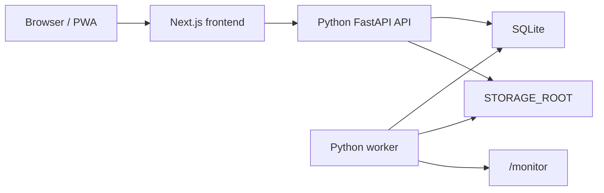

# Python Backend Runtime

BookNook Starship now uses Python as the backend runtime. The Next.js app is only the React frontend and an internal `/api/*` rewrite target.

## Runtime Boundaries

- Frontend: `apps/web` renders pages and calls `/api/...`.
- API: `apps/api-python/app/main.py` serves all public API routes through FastAPI.
- Worker: `apps/api-python/app/worker` handles monitor-folder importing.
- Database schema initialization is owned by Python API/Worker startup via Alembic; there is no separate migrator container.
- Next.js API route handlers under `apps/web/app/api` have been removed.
- TypeScript scanner/import/organize backend code under `packages/scanner` has been removed.

## SQLite schema migrations (Alembic)

- Authority: Alembic revisions under `apps/api-python/app/db/alembic/versions/`. Revisions `0001` through `0003` are immutable published history. `0004_schema_normalization` converts the Alembic-created and pre-Alembic v14 layouts to one immutable schema snapshot before later feature migrations run.
- Startup path (`app/db/bootstrap.py` → `app/db/runner.py`):
  - empty DB → `alembic upgrade head`
  - existing DB with `alembic_version` → `upgrade head`
  - pre-Alembic DB with `user_version == 14` → stamp `0003_import_work_queue`, then `upgrade head`
  - non-empty unversioned DB, including one created directly from runtime ORM metadata → reject as unsupported
  - any other populated DB, including `user_version < 14` → reject as unsupported
- A revision number is a physical schema contract. `0004` rebuilds every baseline table from the checked-in `0004_baseline.json` snapshot, normalizes timestamp storage, and validates all foreign keys before commit. Migration tests compare complete table, column, default, key, index, and check-constraint fingerprints across distinct predecessor layouts.
- A database left with partially applied DDL by an older failed media-version migration is not a valid `0003` source and is rejected. Restore the automatic `booknook-before-alembic-0003_import_work_queue-to-*.sqlite3` snapshot before starting the corrected image; `0004` does not delete rows or guess how to repair a malformed predecessor.
- `app/db/seed.py` only inserts missing baseline records: `systemName`, `language`, `workDetail.tabOrder`, and the three built-in metadata Sources. It never overwrites existing records, runs historical backfills, repairs business state, or writes migration markers.
- Timestamp normalization triggers are ensured after every schema apply (`app/db/timestamp_triggers.py`). Table and column discovery uses SQLAlchemy Inspector. SQLite has no SQLAlchemy schema construct for triggers, so the final `CREATE/DROP TRIGGER` DDL is a narrow dialect-specific exception owned by DB bootstrap; remove it once every non-legacy timestamp writer uses typed SQLAlchemy ORM/expression APIs.
- Backup archives remain format version 2 and include `databaseRevision`. Restore is allowed only when that value equals the current Alembic head; archives without the field and archives from another revision remain listable/downloadable but fail before clearing data with `BACKUP_DATABASE_REVISION_UNSUPPORTED`.
- The minimum supported pre-Alembic database is v14. Databases older than v14 must first be upgraded with an older application release.
- CLI: `python -m app.db.bootstrap` (same entry as before); Alembic config at `app/db/alembic.ini`.

## Verification

- `apps/api-python/tests/test_route_coverage.py` asserts that Next.js API routes are absent.
- `apps/web/lib/next-config-rewrites.test.ts` verifies that `/api/:path*` is rewritten to `http://127.0.0.1:8000`.
- `scripts/verify-python-backend-migration.mjs` runs Python tests, runtime smokes, frontend typecheck/tests, and Compose topology checks.

## Operational Notes

- The unified `web` container starts Next.js, FastAPI, and the Python worker with `scripts/start-unified-app.sh`.
- Production Compose exposes only `web`; SQLite lives in the mounted storage directory.
- The public `/api/...` contract is owned by Python. New backend behavior should be added under `apps/api-python`, not `apps/web`.
